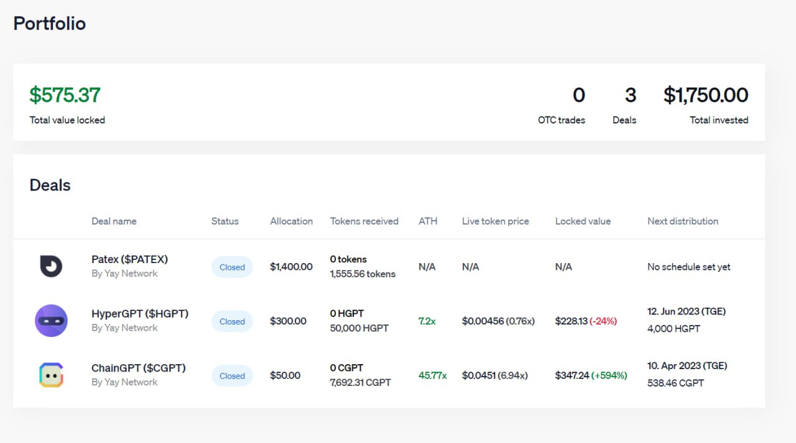

# Explore the Launchpad

The YAY Network Launchpad offers an intuitive interface, streamlining your access to everything essential for your web3 journey. Dive into this detailed guide to harness the full potential of this powerful tool and propel your web3 experience to new heights!

**Create your profile:**

Begin your journey by registering on the YAY Network platform. Use [this link](https://invest.yay.network/users/sign\_up) to access the launchpad. Upon entry, you'll need to connect your wallet. Following this, you'll be guided through a straightforward KYC process to verify your identity.&#x20;

This step is essential for compliance purposes.

<figure><figcaption>
YAY Network Launchpad Registration Page
</figcaption></figure>

**Navigating the Launchpad:**

<figure><figcaption>
YAY Network Launchpad Deals Page
</figcaption></figure>

After successful registration, navigating the platform is a breeze.&#x20;

The '**Deals**' page showcases all the ongoing fundraise deals available on the launchpad. To apply for any sale, simply ensure you have YAY tokens staked in the same wallet you've registered with, and register your intention to participate on this same page.

<figure><figcaption>
YAY Network Launchpad Portfolio Page
</figcaption></figure>

On the '**Portfolio**' page, you can seamlessly track all your investments facilitated through the YAY Network. This comprehensive overview provides details like the token name, allocation status, allocation size, tokens already claimed, the token's all-time high price, current live token price, the quantity of tokens yet to be unlocked, and the date of the next token distribution.

<figure><figcaption>
YAY Network Launchpad OTC Marketplace Page
</figcaption></figure>

The final destination on the YAY Network Launchpad is the 'OTC' page. This is where you can sell any allocations you've acquired or purchase allocations from other users. This can be done pre-TGE, including with locked amounts.&#x20;

All transfers are automated, and the platform facilitates direct communication between sellers and buyers, allowing for negotiations on deal specifics.
